# TSC-CRM — Odoo 18 CRM Module

Hệ thống CRM tích hợp cho viễn thông và giải pháp số — TSC/Unitel.

## Tổng quan

Hệ thống CRM-TSC là nền tảng tích hợp CRM + Order + Workflow + Integration chuyên biệt cho dịch vụ viễn thông và giải pháp số. Xây dựng trên Odoo 18.

**Mục tiêu:**
- Quản lý dịch vụ, gói cước, khuyến mại và combo linh hoạt
- Vận hành quy trình khép kín: Order → Hợp đồng → Thanh toán → Hóa đơn
- Tính hoa hồng tự động cho đa đối tượng
- Tích hợp hệ sinh thái: Unipay, BCCS3, LaoID, VOffice

## Cấu trúc module

```
addons/
├── tsc_crm/              # Core: Lead, Order, Region, Employee, Dashboard, SLA, Technical Task
├── tsc_crm_auth/         # Xác thực: OTP, LaoID SSO, Customer Registration, Login Log
├── tsc_crm_service/      # Dịch vụ: Service, Package, Combo, Discount, Promotion, Agency
├── tsc_crm_workflow/     # Quy trình: Contract, Invoice, Payment, VAT/WHT, Exchange Rate, VOffice
├── tsc_crm_commission/   # Hoa hồng: Commission rules & auto-calculation
├── tsc_crm_admin/        # Quản trị: Organization hierarchy, Role & Permission
└── tsc_crm_integration/  # Tích hợp: Notification, Landing Page, External APIs, Frontend
```

## Screenshot

### Login & Signup
| | |
|---|---|
| 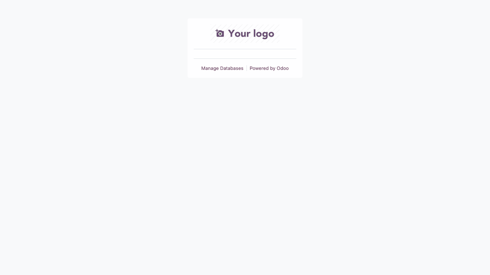 | 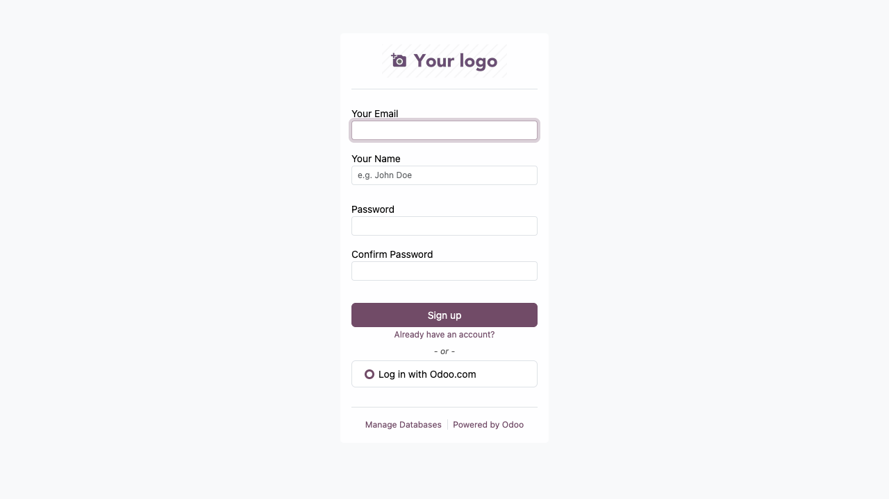 |

### Dashboard & Core
| | |
|---|---|
| 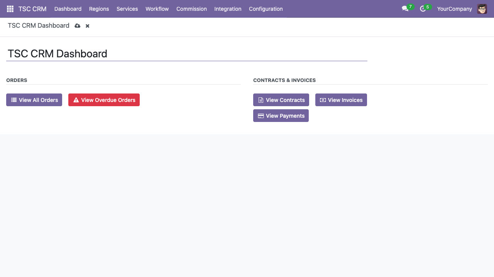 | 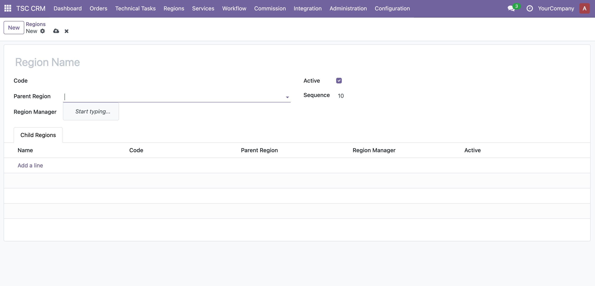 |

### Service Catalog
| | | |
|---|---|---|
| 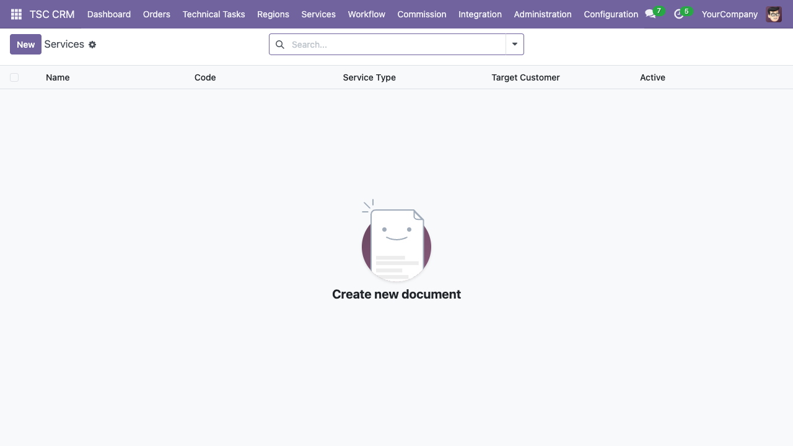 | 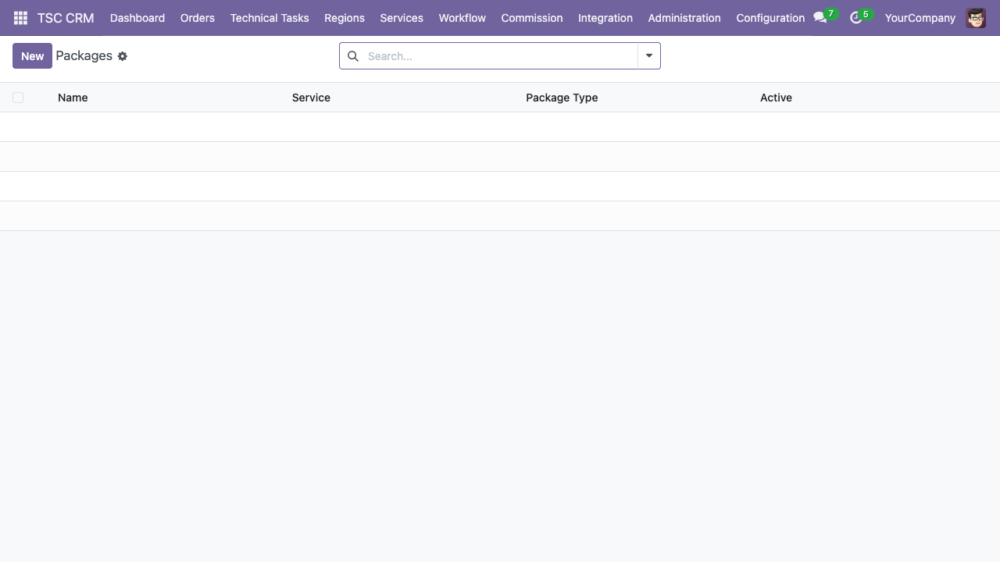 | 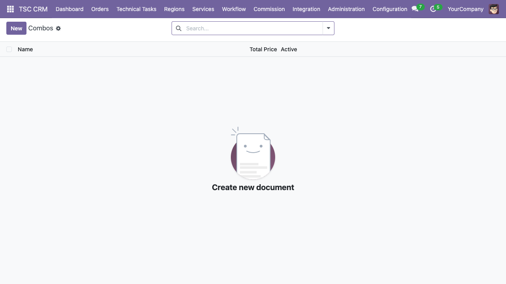 |
| 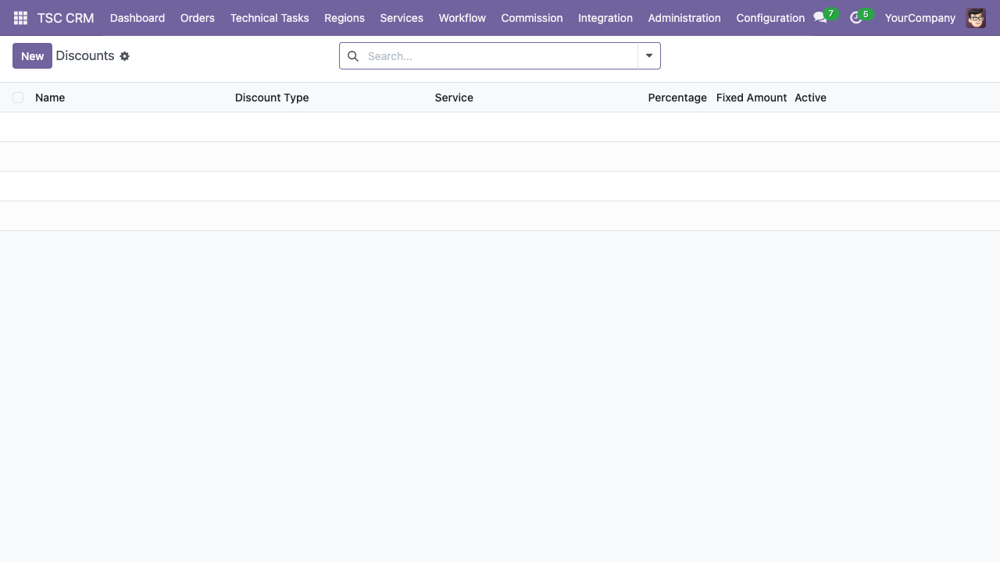 |  | |

### Workflow & Billing
| | | |
|---|---|---|
| 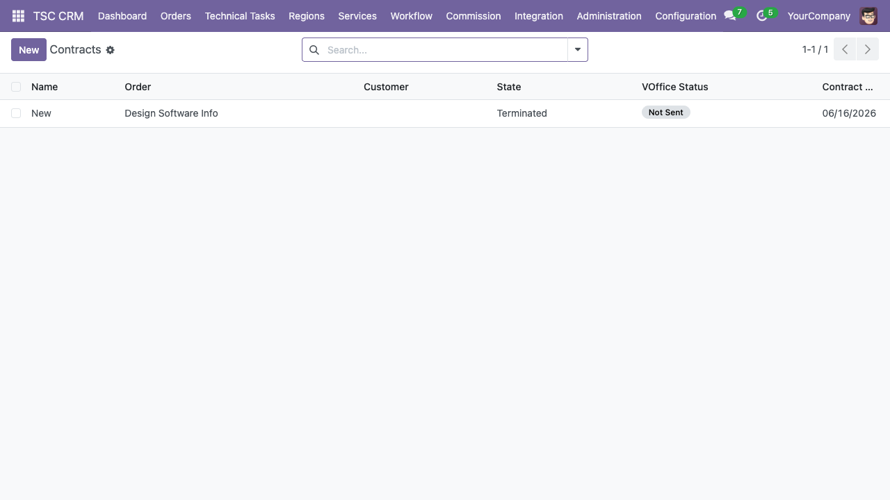 | 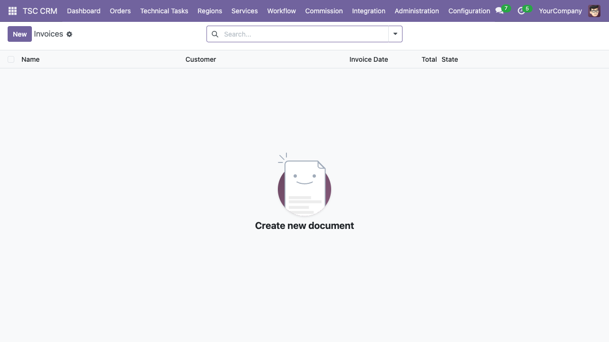 |  |
| 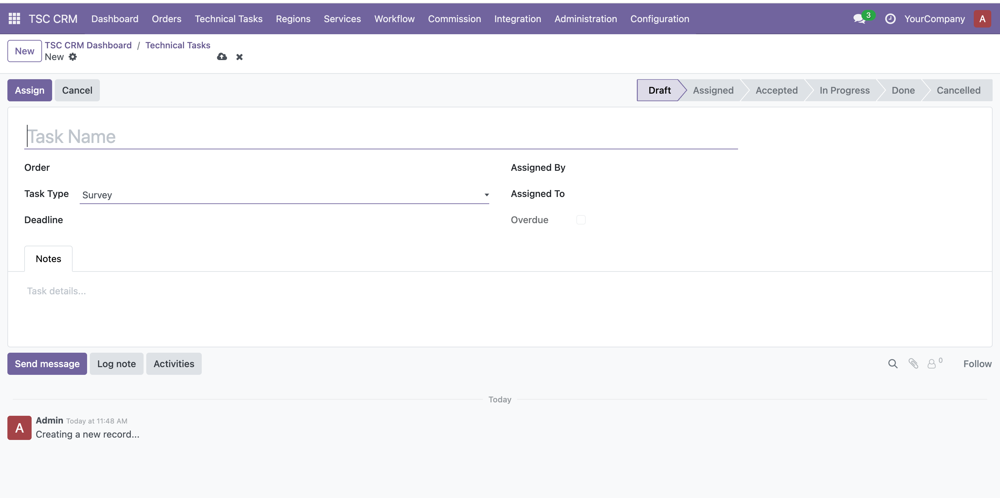 | 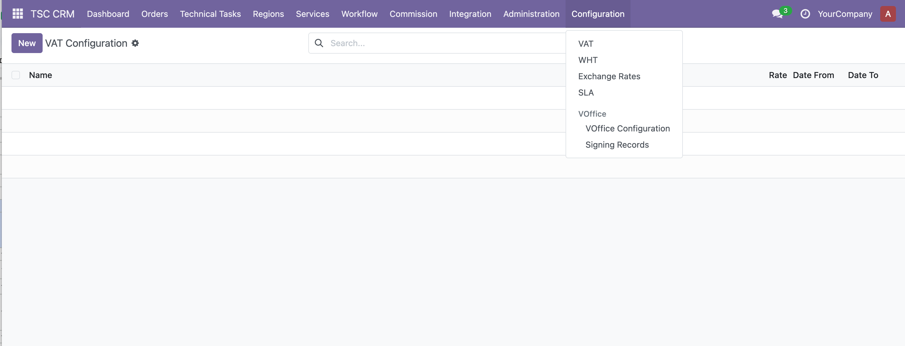 | |

### Commission
| | |
|---|---|
| 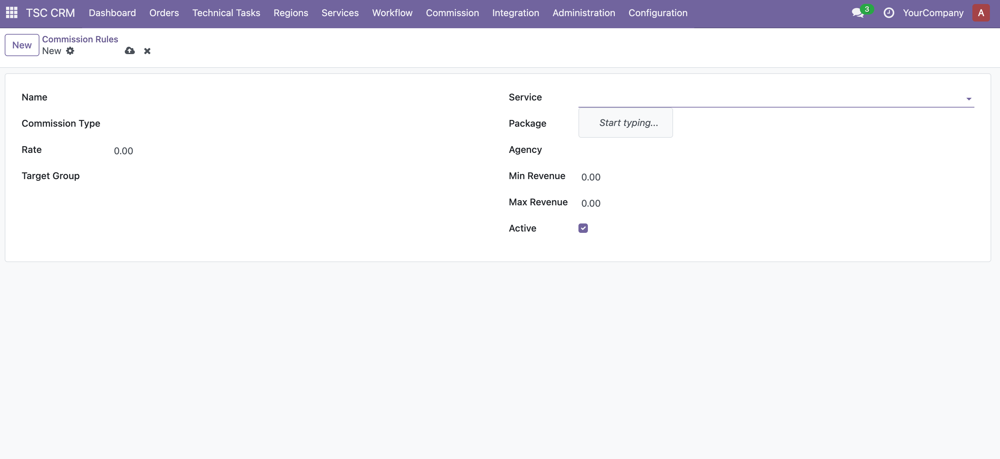 | 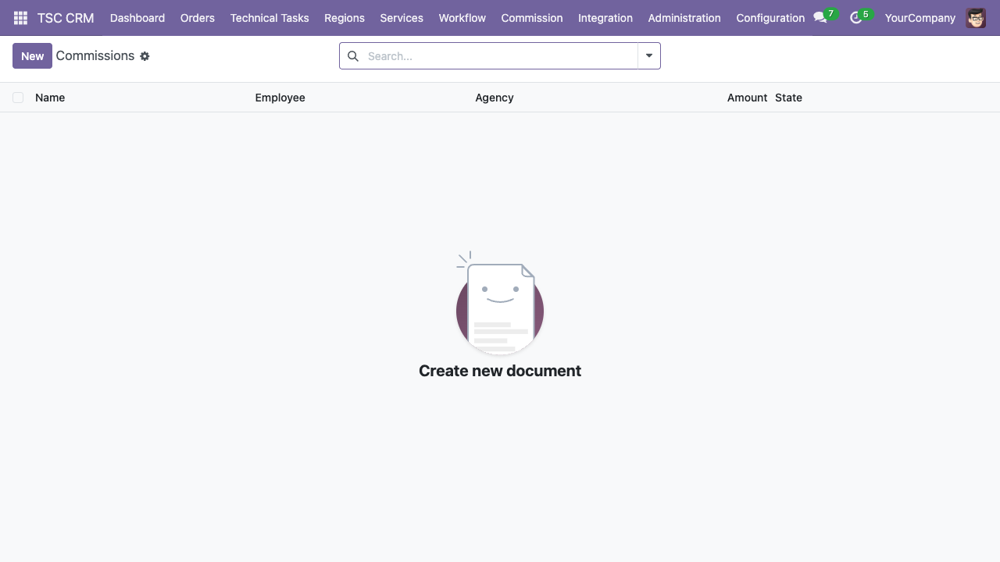 |

### Administration
| | | |
|---|---|---|
| 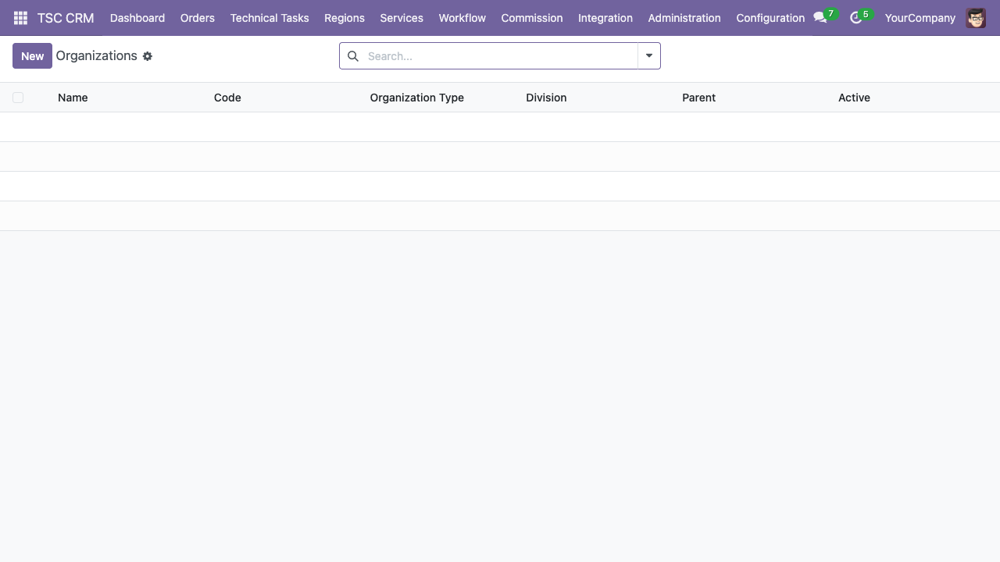 | 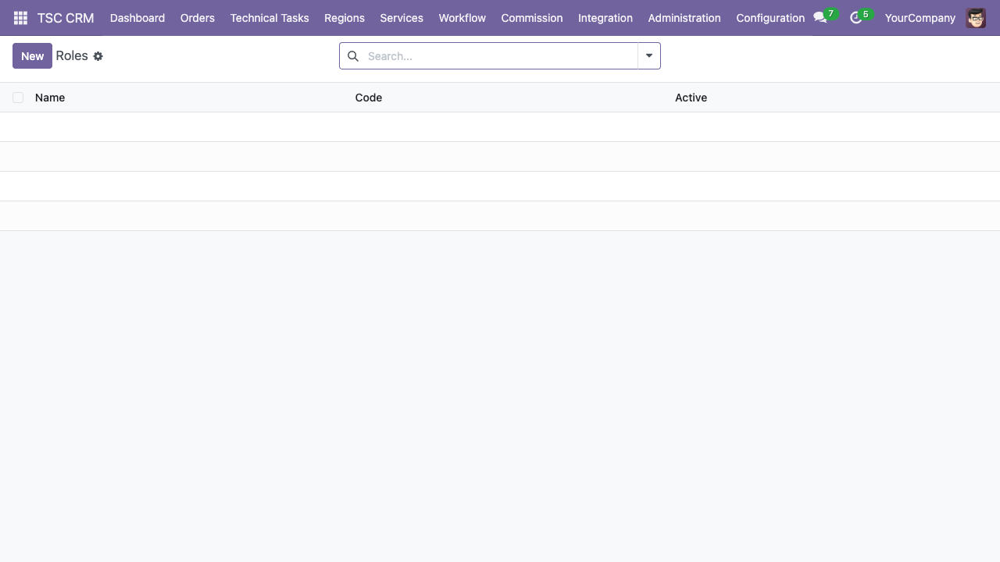 |  |

### Integration
| | |
|---|---|
| 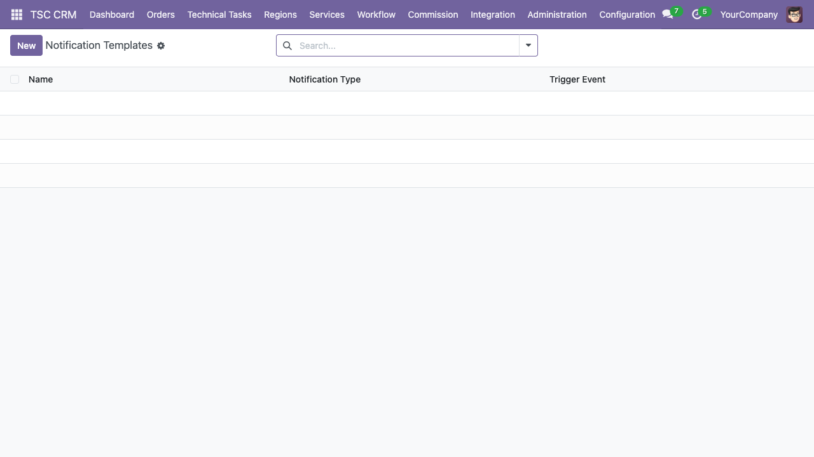 | 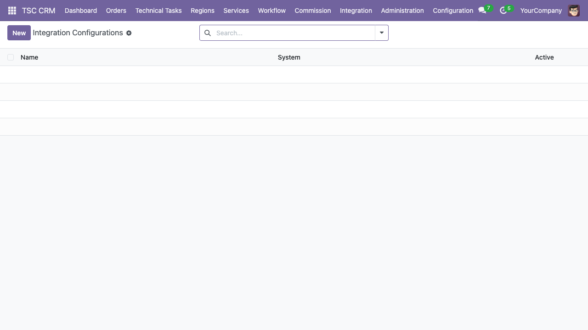 |

## Yêu cầu

- Python 3.10+
- Docker & Docker Compose
- Odoo 18 (hoặc dùng Docker image `odoo:18`)
- PostgreSQL 15

## Cài đặt

### Docker (Khuyến nghị)

```bash
# Clone repository
git clone https://github.com/minhgv/tsc-crm-odoo.git
cd tsc-crm-odoo

# Khởi động Odoo + PostgreSQL
docker compose up -d

# Truy cập Odoo
# URL:      http://localhost:8069
# Database: tsc_crm
# User:     admin
# Password: admin
```

### Cài đặt module

```bash
# Cài tất cả module
docker compose exec odoo odoo -d tsc_crm \
  -i tsc_crm,tsc_crm_auth,tsc_crm_service,tsc_crm_workflow,tsc_crm_commission,tsc_crm_admin,tsc_crm_integration \
  --stop-after-init

# Hoặc dùng script
./test-docker.sh install
```

### Cài đặt thủ công

```bash
pip install odoo

odoo --addons-path=addons,/path/to/odoo/addons \
  -d tsc_crm \
  -i tsc_crm,tsc_crm_auth,tsc_crm_service,tsc_crm_workflow,tsc_crm_admin \
  --dev=xmlrpc
```

## Sử dụng

### Lệnh Docker

```bash
./test-docker.sh up        # Khởi động
./test-docker.sh down      # Dừng
./test-docker.sh install   # Cài module
./test-docker.sh update    # Update module
./test-docker.sh test      # Chạy test
./test-docker.sh reset     # Reset DB và cài lại
./test-docker.sh logs      # Xem log
```

### Lệnh Odoo

```bash
# Update module
odoo -d tsc_crm -u tsc_crm

# Chạy test
odoo -d tsc_crm --test-enable --stop-after-init

# Odoo shell
odoo shell -d tsc_crm
```

## Chức năng chi tiết

### 1. CRM Core (`tsc_crm`)

**Models:** `crm.lead` (extend), `crm.team` (extend), `res.partner` (extend), `hr.employee` (extend), `tsc.region`, `tsc.order.line`, `tsc.order.assignment`, `tsc.technical.task`, `tsc.dashboard`

- **Order Management**: Auto-generated Order ID (`ORD-XXXX`), 7-state workflow (Created → Assigned → Accepted → Surveying → Confirm → Contract → Paid)
- **Region Hierarchy**: 4 cấp (TSC → tỉnh → mường → bản), tự hiển thị `Parent / Child`
- **Order Assignment**: Auto-assign theo region/team, audit log every assign/reassign
- **Technical Task**: 6-state workflow (Draft → Assigned → Accepted → In Progress → Done → Cancelled), overdue tracking
- **SLA Tracking**: 5 stages (Assignment, Survey, Implementation, Contract, Payment)
- **Dashboard**: Total orders, overdue orders, stage stats, region stats, task stats
- **Security Groups**: Admin, Manager, Staff Business, Staff Technical, Staff CC
- **i18n**: English (default), Lao, Vietnamese

### 2. Authentication (`tsc_crm_auth`)

**Models:** `res.users` (extend), `tsc.otp.code`, `tsc.customer.registration`, `tsc.login.log`, `tsc.laoid` (abstract)

- **OTP Login**: 6-digit code, 5-minute expiry, max 3 attempts
- **LaoID SSO**: OAuth 2.0 flow, auto-create/find user
- **Customer Registration**: OTP verification → create partner + user
- **Login Log**: Records all login attempts (backend/OTP/LaoID)
- **API Endpoints**: `/api/auth/otp/send`, `/otp/verify`, `/register`, `/logout`, `/me`
- **LaoID Config**: Environment (production/UAT), client_id, client_secret

### 3. Service Catalog (`tsc_crm_service`)

**Models:** `tsc.service`, `tsc.package`, `tsc.package.level`, `tsc.combo`, `tsc.combo.line`, `tsc.discount`, `tsc.promotion`, `tsc.discount.policy`, `tsc.agency`

- **Service**: CMS fields (logo, icon, banner, slogan, description, policy), target customer, distribution channel
- **Package**: 2 types (per_use/cycle), levels with different prices, deployment_fee, trial_days
- **Combo**: Bundle multiple services+packages, auto-calculate total price
- **Promotion**: Fixed/percentage, scoped to line/package/service, date range
- **Discount Policy**: By revenue/order count, for all/specific agents
- **Agency**: Revenue tiers (Tier 1/2/3)

### 4. Workflow & Billing (`tsc_crm_workflow`)

**Models:** `tsc.contract`, `tsc.contract.template`, `tsc.contract.audit`, `tsc.invoice`, `tsc.invoice.line`, `tsc.payment`, `tsc.vat.config`, `tsc.wht.config`, `tsc.exchange.rate`, `tsc.voffice.config`, `tsc.voffice.sign`

- **Contract**: 7 states, auto-sequence (`CT-XXXX`), template, audit trail, VOffice integration
- **Invoice**: VAT/WHT auto-calculation, 5 states (Draft → Posted → Paid → Cancelled/Refunded)
- **Payment**: 6 methods (Unipay Wallet/Bank, QR, Mobile, uMoney, Cash)
- **Exchange Rate**: Daily rates from BCEL, weekend logic (use nearest previous date)
- **VOffice Integration**: Upload document → Send and sign → Check status → Download signed file
- **SLA Config**: Stage-based time limits with working hours option

### 5. Commission (`tsc_crm_commission`)

**Models:** `tsc.commission.rule`, `tsc.commission`

- **Rules**: Percentage/fixed, target group (AM/Agency/Staff/Management), filter by service/package/agency
- **Auto-calculation**: Triggered on invoice payment, creates commission records
- **Workflow**: Draft → Approved → Paid

### 6. Administration (`tsc_crm_admin`)

**Models:** `tsc.organization`, `tsc.role`, `tsc.permission`, `tsc.role.permission`

- **Organization Hierarchy**: 4 levels (TSC HQ → province → district → village), 3 divisions (Business/Technical/CC)
- **Role & Permission**: CRUD-based permissions, unique role-permission mapping
- **Phase 1 Default Roles**: Admin, Manager, Staff

### 7. Integration (`tsc_crm_integration`)

**Models:** `tsc.notification.template`, `tsc.notification.log`, `tsc.integration.config`, `tsc.integration.log`, `tsc.landing.page`

- **Notification**: Templates for SMS/Email/Push with 7 trigger events
- **External Systems**: Unipay, BCCS3, Datalake, VOffice, SMS Gateway configs
- **Landing Page**: CMS for public website with SEO fields
- **Frontend Controllers**: `/services`, `/order/create`, `/order/<code>/status`, `/invoice/<code>`
- **QWeb Templates**: Service list, service detail, order create, order status, invoice view

## Kiến trúc hệ thống

### Architecture Layers

```
┌─────────────────────────────────────────────────────┐
│                PRESENTATION LAYER                    │
│  Web Admin/Staff │ Miniapp/Web │ Landing Page           │
├─────────────────────────────────────────────────────┤
│                BUSINESS LOGIC LAYER                  │
│  tsc_crm │ tsc_crm_auth │ tsc_crm_service           │
│  tsc_crm_workflow │ tsc_crm_commission              │
│  tsc_crm_admin │ tsc_crm_integration                │
├─────────────────────────────────────────────────────┤
│                DATA ACCESS LAYER                     │
│  Odoo ORM → PostgreSQL                               │
│  crm.lead │ crm.team │ res.partner │ hr.employee     │
│  + 41 custom models                                  │
└─────────────────────────────────────────────────────┘
```

### Module Dependencies

```
tsc_crm (Core)
├── tsc_crm_auth (depends: base, auth_signup, auth_oauth)
├── tsc_crm_service (depends: tsc_crm)
├── tsc_crm_workflow (depends: tsc_crm, tsc_crm_service)
├── tsc_crm_commission (depends: tsc_crm, tsc_crm_service, tsc_crm_workflow)
├── tsc_crm_admin (depends: tsc_crm, tsc_crm_auth)
└── tsc_crm_integration (depends: tsc_crm, tsc_crm_service, tsc_crm_workflow, tsc_crm_auth)
```

### External Integrations

| System | Protocol | Purpose |
|--------|----------|---------|
| Unipay | REST API | Payment processing (Wallet/Bank/QR/Mobile/uMoney) |
| BCCS3 | REST API | Push invoices, sync billing |
| VOffice | REST API | Contract digital signing |
| LaoID | OAuth 2.0 | Employee SSO authentication |
| SMS Gateway | REST API | OTP, notifications, alerts |
| BCEL | Web | Exchange rate data |

## Cấu hình

### LaoID SSO

Vào **Settings > Technical > System Parameters**:

| Key | Value |
|-----|-------|
| `tsc.laoid.client_id` | OAuth client ID |
| `tsc.laoid.client_secret` | OAuth client secret |
| `tsc.laoid.callback_url` | `https://your-domain/auth/laoid/callback` |
| `tsc.laoid.environment` | `production` hoặc `uat` |

### VOffice

Vào **TSC CRM > Configuration > VOffice > VOffice Configuration**:
- API URL: `https://crm.laoid.net/apis`
- Username / Password

### VAT / WHT

Vào **TSC CRM > Configuration > VAT** và **WHT**:
- Tỷ lệ VAT/WHT theo thời gian
- Ví dụ: VAT 7% (01/01-30/04), 10% (01/05-30/11), 7% (01/12-31/12)

### Tỷ giá

Vào **TSC CRM > Configuration > Exchange Rates**:
- Cập nhật hàng ngày theo BCEL
- Tự động áp dụng theo ngày xuất hóa đơn
- Weekend logic: T7/CN dùng tỷ giá ngày gần nhất

## Tests

```bash
# Chạy tất cả test
docker compose exec odoo odoo -d tsc_crm \
  -i tsc_crm,tsc_crm_service,tsc_crm_workflow,tsc_crm_auth,tsc_crm_commission,tsc_crm_admin,tsc_crm_integration \
  --test-enable --stop-after-init --no-http

# Hoặc
./test-docker.sh test
```

**Test Coverage:**

| Module | Test Files | Test Cases |
|--------|-----------|------------|
| tsc_crm | 8 | ~35 |
| tsc_crm_auth | 4 | ~15 |
| tsc_crm_service | 7 | ~25 |
| tsc_crm_workflow | 5 | ~25 |
| tsc_crm_commission | 1 | ~8 |
| tsc_crm_admin | 2 | ~8 |
| tsc_crm_integration | 3 | ~12 |
| **Total** | **30** | **~128** |

## User Stories

Xem chi tiết tại [`docs/user-stories.md`](docs/user-stories.md) — 29 user stories, 104 test cases.

## Project Stats

| Metric | Count |
|--------|-------|
| Python files | 96 |
| XML files | 43 |
| CSV files | 7 |
| i18n files | 19 |
| Models | 41 custom + 4 extended |
| Test files | 30 |
| Screenshots | 22 |

## Known Issues

1. `unique=True` field parameter warnings — Should use `_sql_constraints` instead (non-blocking)
2. `tsc_source` field label conflicts with CRM's `source_id` — Different fields, same label

## License

LGPL-3
